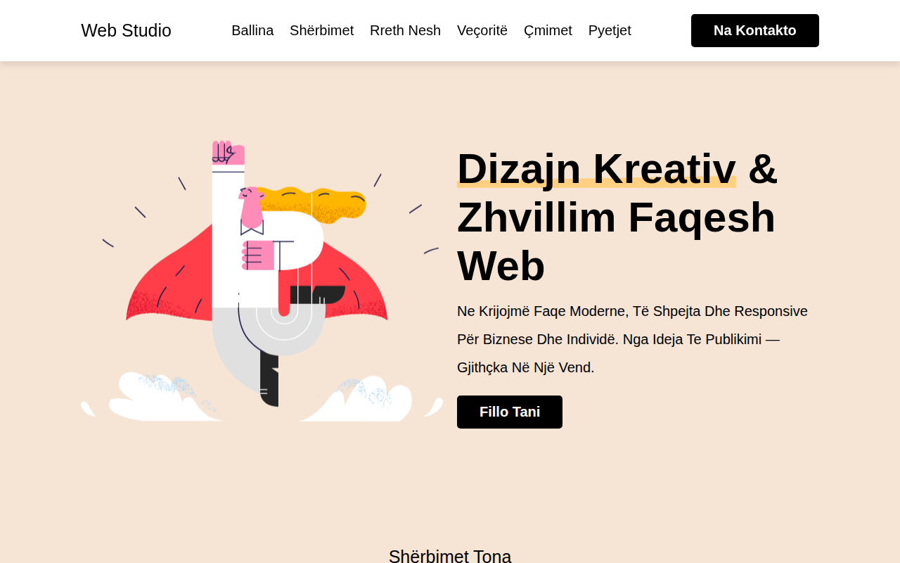

# Web Studio — Faqe moderne

Faqe moderne web studioje me dizajn responsive — shërbime, veçori, çmime, pyetje të shpeshta dhe kontakt. E gjithë përmbajtja e dukshme është në gjuhën shqipe.

**Demo live:** https://erionnezha.github.io/Coding-Website/



## Si hapet lokalisht

Shkarkoni këtë repo dhe hapni `index.html` në shfletues — nuk kërkohet server apo ndërtim:

```bash
git clone https://github.com/ErionNezha/Coding-Website.git
cd Coding-Website
# hapni index.html në shfletues
```

## Teknologjitë

- HTML5
- CSS3 (me SCSS burimor në `css/style.scss`)
- JavaScript (vanilla)
- Font Awesome 5 (CDN)

## Struktura

```
Coding-Website/
├── index.html
├── css/
│   ├── style.css
│   └── style.scss
├── js/
│   └── script.js
├── images/
├── screenshot.png
├── README.md
└── LICENSE
```

## Kontakti

- Telefon: +355 6XX XXX XXX
- Email: shembull@example.com
- Vendndodhja: Tiranë, Shqipëri

## Shënim

Formulari i newsletter-it në faqe është vetëm vizual — nuk ka backend PHP, ndaj nuk dërgon email-e në GitHub Pages (vendosja statike). Për kontakt përdorni email-in ose telefonin më sipër.

## Licenca

Të gjitha të drejtat e rezervuara © 2026 Erion Nezha — shihni [LICENSE](LICENSE).

---

# Web Studio — Modern Page (English)

A modern, responsive web-studio landing page — services, features, pricing, FAQ and contact. All visible content is in Albanian.

**Live demo:** https://erionnezha.github.io/Coding-Website/


## Run locally

Download this repo and open `index.html` in a browser — no server or build step needed:

```bash
git clone https://github.com/ErionNezha/Coding-Website.git
cd Coding-Website
# open index.html in your browser
```

## Tech

- HTML5
- CSS3 (SCSS source in `css/style.scss`)
- Vanilla JavaScript
- Font Awesome 5 (CDN)

## Contact

- Phone: +355 6XX XXX XXX
- Email: shembull@example.com
- Location: Tirana, Albania

## Note

The newsletter form on the page is decorative only — there is no PHP backend, so it cannot send emails on GitHub Pages (static hosting). Use the email or phone above to get in touch.

## License

All rights reserved © 2026 Erion Nezha — see [LICENSE](LICENSE).
